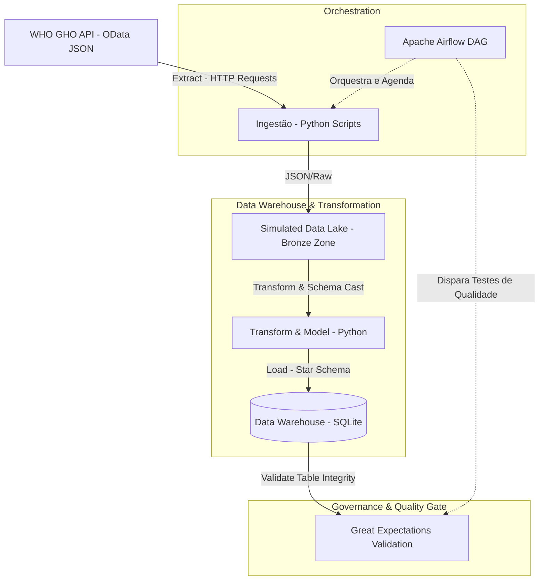

# 🇺🇳 WHO Global Health Observatory (GHO) Data Warehouse & ETL Pipeline

Este projeto implementa um pipeline completo de Engenharia de Dados (ETL) e um Data Warehouse estruturado a partir dos dados públicos de saúde global fornecidos pela **API OData da Organização Mundial da Saúde (OMS / WHO)**.

O objetivo do projeto é construir uma fonte única de verdade (Single Source of Truth) modelada para consultas analíticas de alta performance, utilizando práticas modernas de modelagem dimensional (Star Schema), governança e orquestração de dados.

---

## 🏗️ Arquitetura Técnica & Pipeline de Dados



---

## 📊 Modelagem Dimensional (Kimball Star Schema)

Para otimizar o desempenho de leituras analíticas, os dados foram transformados de estruturas JSON aninhadas e normalizados em um esquema estrela:

### Tabela Fato
*   **`fact_observations`**: Centraliza os fatos numéricos medidos pela OMS.
    *   `observation_id` (PK)
    *   `indicator_id` (FK ➡️ `dim_indicators`)
    *   `location_id` (FK ➡️ `dim_locations`)
    *   `period_id` (FK ➡️ `dim_periods`)
    *   `sex_id` (FK ➡️ `dim_sex`)
    *   `value` (Valor numérico da observação)

### Tabelas de Dimensão
*   **`dim_indicators`**: Metadados estruturais sobre a saúde humana (ex: indicadores de poluição, mortalidade infantil, etc.).
*   **`dim_locations`**: Informações geográficas dos países, com enriquecimento de dados regionais e continentes.
*   **`dim_periods`**: Dimensão de tempo para controle cronológico.

---

## 🔒 Qualidade de Dados (Great Expectations)

Para evitar desvio de esquema (*schema drift*) ou ingestão de valores nulos inconsistentes provenientes de atualizações de API, o pipeline de dados utiliza o **Great Expectations**:
*   **Validação de Metadados**: Garante que os códigos de indicadores e dimensões OData seguem os contratos estabelecidos.
*   **Validação de Fatos**: Impede que observações de saúde com valores ausentes ou nulos passem silenciosamente para a camada final.
*   **Relatórios Automatizados**: Relatórios em HTML detalhando a saúde e conformidade dos dados a cada execução de DAG.

---

## ⏱️ Orquestração (Apache Airflow)

O pipeline é orquestrado por meio do **Apache Airflow**, com uma DAG (`oms_data_pipeline`) que automatiza as seguintes etapas diárias de processamento:
1.  Execução do roteiro de ingestão e população dimensional (`populate_database`).
2.  Disparo em paralelo de três suítes de validação de dados via Great Expectations (`validate_indicators_data`, `validate_categorized_indicators_data`, `validate_dimensions_data`).

---

## 🚀 Como Rodar o Projeto

### Pré-requisitos
* Python 3.11+ instalado.
* Dependências listadas no `requirements.txt`.

### Configuração do Ambiente
1. Clone o repositório:
   ```bash
   git clone https://github.com/Roberton003/projeto_oms.git
   cd projeto_oms
   ```
2. Crie e ative o ambiente virtual:
   ```bash
   python -m venv venv
   source venv/bin/activate  # No Windows: venv\\Scripts\\activate
   pip install -r requirements.txt
   ```

3. Inicialize o Banco de Dados e execute a carga inicial:
   ```bash
   python scripts/create_database.py
   python scripts/populate_database.py
   ```

4. Execute os testes de qualidade de dados:
   ```bash
   python scripts/validate_dimensions.py
   python scripts/validate_categorized_indicators.py
   ```

---

## 📥 Como Obter os Dados

Os dados são obtidos diretamente da **API OData do WHO GHO** (`https://ghoapi.azureedge.net/api/`).

### Ingestão via API

```bash
python scripts/coleta_oms.py
```

O script `coleta_oms.py` busca a lista de indicadores e salva em `data/indicators.csv`.
O pipeline completo (`populate_database.py`) chama a API por indicador — ex. `https://ghoapi.azureedge.net/api/NCDMORT3070` — e popula o star schema em `database/who_gho.db`.

### Fixtures de Teste

Os arquivos em `tests/fixtures/` são snapshots dos dados da API para uso em CI/CD:
- `indicators.csv` — lista de indicadores (251 KB)
- `categorized_indicators.csv` — indicadores categorizados (268 KB)
- `dimensions.json` — dimensões da API (11 KB)
- `regions.json` — regiões da OMS

> ⚠️ Dados brutos não são versionados na raiz `data/` — apenas como fixtures em `tests/fixtures/`.
> Execute `scripts/coleta_oms.py` para refrescar os dados da API.
