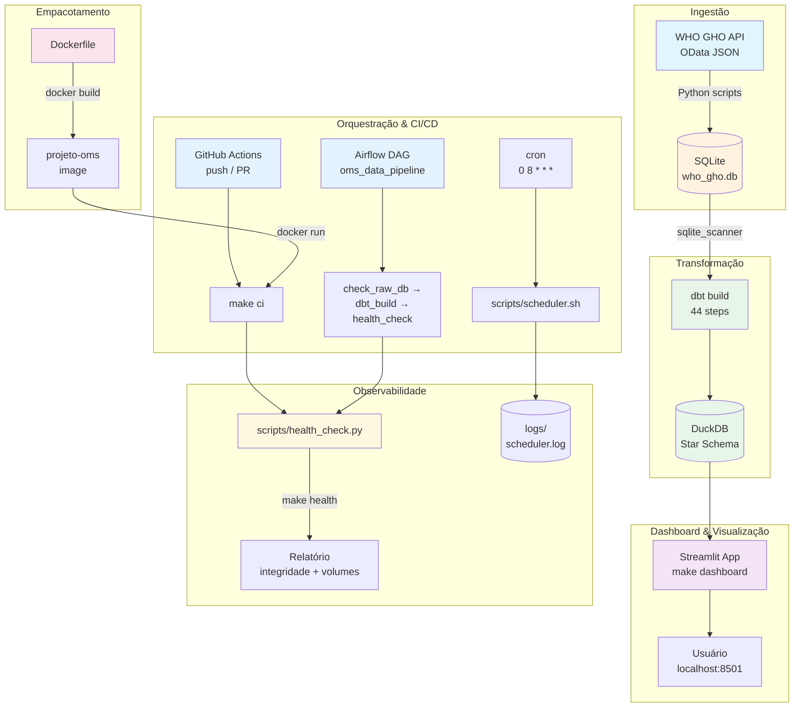
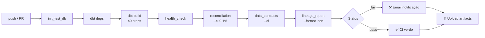

# WHO Global Health Observatory — Star Schema Analytics

Pipeline analítico sobre dados públicos de saúde global da **Organização Mundial da Saúde (WHO GHO API)**, modelado em Star Schema com **dbt + DuckDB**.

---

## Arquitetura

```
┌──────────────────┐     ┌─────────────────┐     ┌──────────────────────┐
│  WHO GHO API     │────▶│  SQLite (raw)    │────▶│  dbt + DuckDB        │
│  (OData JSON)    │     │  who_gho.db      │     │  Star Schema (marts) │
└──────────────────┘     └─────────────────┘     ├──────────────────────┤
                                                  │ dim_indicator        │
                                                  │ dim_location         │
                                                  │ dim_period           │
                                                  │ dim_sex              │
                                                  │ fct_observations     │
                                                  └──────────────────────┘
                                                           │
                                                           ▼
                                                  ┌──────────────────┐
                                                  │  Testes dbt      │
                                                  │  32 testes       │
                                                  │  (unique, not    │
                                                  │   null, rel.,    │
                                                  │   accepted val.) │
                                                  └──────────────────┘
```

### Ecossistema Completo



### Fluxo

1. **Ingestão**: Scripts Python consomem a API OData da OMS e populam um banco SQLite raw (`database/who_gho.db`)
2. **Transformação (dbt)**: dbt-core com adaptador DuckDB lê o SQLite via extensão `sqlite_scanner` e constrói o Star Schema
3. **Testes**: 32 testes de dados (unique, not_null, relationships, accepted_values) garantem integridade
4. **Incremental**: `fct_observations` usa materialização incremental (merge por `observation_id`)
5. **Observabilidade**: Health check automatizado verifica integridade referencial, volumes e freshness
6. **Dashboard**: Streamlit conectado ao DuckDB para visualização analítica interativa

---

## Stack

| Camada | Tecnologia |
|--------|-----------|
| Transformação | [dbt-core](https://github.com/dbt-labs/dbt-core) 1.11 + [dbt-duckdb](https://github.com/duckdb/dbt-duckdb) 1.10 |
| Query Engine | [DuckDB](https://duckdb.org/) (OLAP embarcado) |
| Raw Storage | SQLite (fonte original) |
| Dashboard | [Streamlit](https://streamlit.io/) + [Plotly](https://plotly.com/) |
| Orquestração | [Apache Airflow](https://airflow.apache.org/) (opcional) / cron |
| CI/CD | GitHub Actions + Docker |
| Observabilidade | Health check automatizado (integridade, volumes, freshness) |

---

## Modelagem Dimensional (Kimball Star Schema)

### Tabela Fato

**`fct_observations`** — grão por observação individual

| Coluna | Tipo | Descrição |
|--------|------|-----------|
| `observation_id` | int | PK natural da fonte |
| `observation_key` | varchar | Surrogate key (hash) |
| `indicator_id` | int | FK → `dim_indicator` |
| `location_id` | int | FK → `dim_location` |
| `period_id` | int | FK → `dim_period` |
| `sex_id` | int | FK → `dim_sex` (0 = UNK) |
| `value` | float | Valor numérico da observação |

### Dimensões

| Tabela | Descrição | Cardinalidade |
|--------|-----------|--------------|
| `dim_indicator` | Indicadores de saúde (código, nome, categoria) | ~3K |
| `dim_location` | Países/regiões (código ISO, nome, região) | ~220 |
| `dim_period` | Períodos (ano, agrupamento por década) | ~70 |
| `dim_sex` | Sexo (MLE, FMLE, BTSX, UNK) | 4 |

---

## Como Executar

### Setup rápido

```bash
# 1. Clonar
git clone https://github.com/Roberton003/projeto_oms.git
cd projeto_oms

# 2. Setup completo
make setup

# 3. Build (modelos + testes)
make build

# 4. Apenas testes
make test
```

### Targets disponíveis

| Comando | Descrição |
|---------|-----------|
| `make setup` | Cria virtualenv + instala dependências + pacotes dbt |
| `make build` | Executa `dbt build` (modelos + testes) |
| `make test` | Executa `dbt test` (apenas testes) |
| `make run` | Executa `dbt run` (apenas modelos) |
| `make ci` | CI completo (banco de teste + clean + build) |
| `make clean` | Limpa artefatos dbt e banco DuckDB |
| `make health` | Health check: integridade, volumes, freshness |
| `make dashboard` | Abre o Streamlit Dashboard no navegador |
| `make schedule` | Executa o pipeline agendado com logging |
| `make shell` | Abre DuckDB shell no banco do target atual |

### CI/CD Pipeline

```bash
make ci
```

O target `ci` executa: init_test_db → clean → deps → build → health_check.

No GitHub Actions, o pipeline completo roda a cada push com **6 gates**:



Cada gate pode falhar independentemente. Se falhar, o GitHub notifica por email com link para os logs.

### Docker

```bash
docker build -t projeto-oms .
docker run --rm projeto-oms make ci
```

---

## Obtenção dos Dados

Os dados são obtidos da API OData do WHO GHO:

```bash
# Listar indicadores disponíveis
python scripts/coleta_oms.py

# Pipeline completo de ingestão
python scripts/populate_database.py
```

O script `populate_database.py` consome a API da OMS por indicador e popula o banco SQLite `database/who_gho.db`, que é então lido pelo dbt.

> **Fixtures de teste**: `tests/fixtures/` contém snapshots dos dados da API para CI/CD.
> Dados brutos não são versionados — execute os scripts de ingestão para obtê-los.

---

## Dashboard Analítico

```bash
make dashboard
```

Dashboard interativo com Streamlit + Plotly conectado diretamente ao DuckDB:

- **Visão Geral**: KPIs (total de observações, indicadores, países, período), distribuição por categoria
- **Tendências**: Evolução temporal com séries por categoria, top países e indicadores
- **Dados Brutos**: Amostra da tabela fato com joins para exploração

Acesso: `http://localhost:8501`

---

## Agendamento (Scheduler)

### Cron (leve, sem dependências)

```bash
# Execução única
bash scripts/scheduler.sh

# Agendar no crontab (diário às 8h)
0 8 * * * /path/to/projeto_oms/scripts/scheduler.sh --ci >> /path/to/projeto_oms/logs/scheduler.log 2>&1
```

### Apache Airflow (orquestração completa)

```bash
pip install apache-airflow
export AIRFLOW_HOME=$(pwd)/airflow
mkdir -p $AIRFLOW_HOME/dags
ln -s $(pwd)/dags/oms_data_pipeline.py $AIRFLOW_HOME/dags/
airflow standalone
```

A DAG `oms_data_pipeline` executa: `check_raw_db → dbt_build → health_check` em sequência diária.

---

## Observabilidade

### Health Check

```bash
make health          # relatório detalhado em texto
make health-ci       # exit 1 se algo errado (para CI gates)
```

O health check verifica:

| Verificação | O que detecta |
|-------------|---------------|
| Existência do raw DB | Banco SQLite ausente ou corrompido |
| Tamanho e freshness | Staleness (dados desatualizados) |
| Contagem de linhas | Variação anômala de volume |
| Integridade referencial | Órfãos nas FKs da tabela fato |
| Existência do DuckDB | Build dbt nunca executado |

### CI/CD com health gate

No GitHub Actions, o health check roda como gate pós-build. Falha no health check = CI vermelho, com artefatos preservados para diagnóstico.

### Logs estruturados

O scheduler gera logs em JSON Lines (`logs/scheduler.log`) para ingestão em sistemas de log centralizado (ELK, Grafana Loki, etc.).

---

## Qualidade de Dados

- **32 testes dbt**: unique, not_null, relationships, accepted_values
- **Health check automatizado**: verificação de integridade referencial e freshness
- **Great Expectations** (opcional): suítes de validação complementares em `scripts/`
- **Incremental idempotente**: `fct_observations` com merge por `observation_id`

---

## Licença

Dados: [WHO GHO](https://www.who.int/data/gho) — uso livre com atribuição.
Código: MIT.
